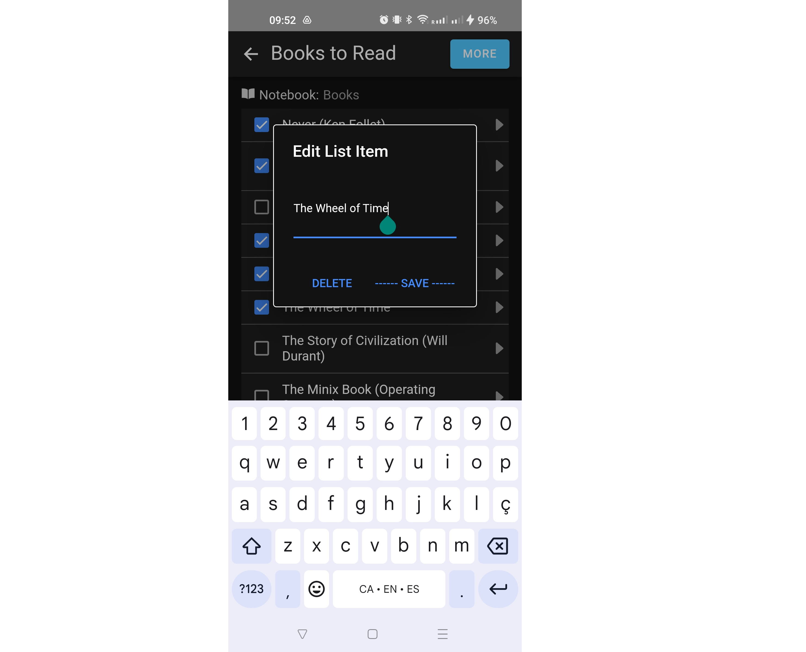

# JB-Notes (Mobile Client)

Mobile app to take notes (Evernote personal clone)<br/>
<br/>
As an Evernote user, I got anoyed enough with the _"join premium"_ popup as to dump the app and write my own.<br/>

This is meant to be a **simpler** and much **faster** way to take/keep notes. It doesn't have all the capabilites, but those basic ones that are more than enough for an easy note taking process.
Slow loading was another reason I dumped Evernote, so I made this app as light and performance as I could.<br/>


## Backend Support

This project works with **Firebase** (Google Cloud), using its real time DB (Firestore).<br/>
To run it you need a `secrets.ts` file where to export your `firebaseConfig` object. 

It uses 2 main collections:
- **notebooks**
- **notes**

Every note must be located into one notebook, and they may have an order of apearence on that notebook.<br/>
The typings for the DB Model are::
```
export interface INotebook {
  id   ?: string;
  name  : string;
  order : string;
}

export interface INote {
  id?         : string;
  notebookId ?: string;
  title       : string;
  content     : string;
  order       : number;
  mode        : 'text' | 'list';
  created     : string;
  updated     : string;
}
```
> [!IMPORTANT]
> Notes are automatically saved on writing (with a debounce of 1500ms), and will also reload automatically from the server in real time, so no saving or loading action is required by the user.<br/>
Only the Notebook details require to be saved when changing them.

## Routing
When no note is selected, the app shows a list of all notes with their title, last update and a brief part of their content.<br/>
You can filter they by **notebook** on the left side panel, to display only those notes.

This is meant to be a starting point, but it won't be the usual view when using the app.

Once you select a note, it takes you to the **_note edit view_**. That is the common view for the app.<br/>
Since the app will remember the last note that was edited, and will always redirect to that one on load, you won't see the list view unless you purposely go there.

## Features
Notes are basic text, without any markup or enrichment. You can select the font type and font size these are displayed on.
This configuration is only saved on the current browser tab, so it rollback to the defaults when you open the app again.


### List Mode
Most of the notes are basics check lists.<br/>
In order to facilitate the handling of those, a doble view is provided with a 2 column layout for the same note content. On the left you will a rendered version of the list with html checkboxes you can click to "check" or "uncheck". On the right side you will see the note in raw text.<br/>
List items are defined by lines starting with a `-`. The check/uncheck value can be added with a `[x]` or `[ ]` characted after the hyphen.


### List Item Edition
By clicking on the left arrow of a list item, you can edit it.
You can change the text in the popup that opens, or delete the item.


### Dark Mode
You can toogle the color theme (light/dark) by clicking the `sun` \ `moon` icon on the header of the main list.<br/>


## ToDos
There are still some features I'd like to add in the future:
- [x] compact list when large
- [x] add share note (to send to email/drive)
- [x] add backups
- [x] add darktheme switch config
- [x] add list item edit (popup)
- [x] add list text edit switch to add "-" when enter
- [x] add notebooks to nest notes
- [ ] change textarea to a custome one
- [ ] add images (icon per note on the list)
- [ ] Build a web version layout

## Web Version
There is an entire different client for web. You can see the project here: https://github.com/joelbarba/jb-notes-web
## Further help
You can leave some comments on the project or contact [me](mailto:joel.barba.vidal@gmail.com) directly for more information.